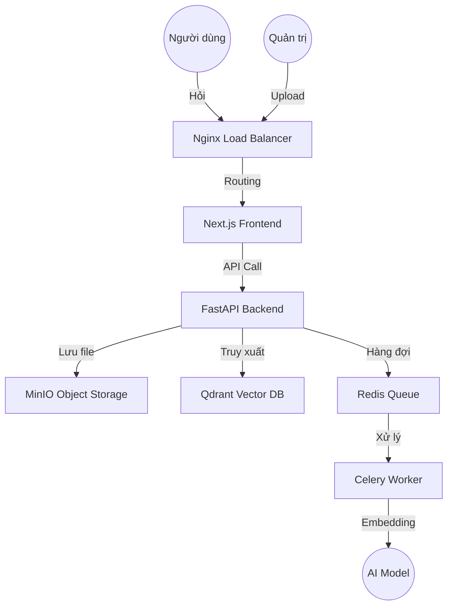

# Technical RepoRAG: Hệ thống hỗ trợ tra cứu Tài liệu Kỹ thuật & Lab

## Tổng quan dự án
Dự án này hướng đến việc xây dựng một hệ thống Retrieval-Augmented Generation (RAG) chuyên sâu cho lĩnh vực kỹ thuật và công nghệ. Hệ thống tập trung vào một tập dữ liệu có độ chính xác cao và giàu tính chuyên môn, chẳng hạn như tài liệu chính thức về Docker, Kubernetes, hoặc các học phần khó trong kiến trúc máy tính và hệ điều hành.

Mục tiêu chính của dự án là hỗ trợ người học và lập trình viên tra cứu, phân tích và giải quyết các vấn đề kỹ thuật phức tạp trong khi thực hiện dự án. Hệ thống có thể được sử dụng để giải thích lỗi cấu hình hệ thống, hướng dẫn xử lý sự cố khi làm việc với container hoặc cluster, cũng như phân tích các đoạn mã Assembly, C, hoặc các ví dụ kỹ thuật khó hiểu.

## Nguồn dữ liệu

Dữ liệu đầu vào của hệ thống bao gồm:

Documentation chính thức từ các công nghệ hoặc môn học được chọn
Các bài Lab thực hành
Mã nguồn mẫu
Code snippets và ví dụ cấu hình
Tài liệu Markdown có cấu trúc

Việc sử dụng nguồn dữ liệu chính thống giúp hệ thống đưa ra câu trả lời có độ tin cậy cao, giảm tình trạng trả lời sai hoặc suy diễn không có căn cứ.

## Kiến trúc hệ thống

## Đánh giá hệ thống

## Công nghệ được sử dụng

| Thành phần | Công nghệ |
| Language | Python 3.13 |
| Framework | FastAPI (Backend), Next.js (Frontend) |
| AI Orchestration | LangChain |
| Vector DB | Qdrant |
| Storage | MinIO (Object Storage), PostgreSQL (Metadata) |
| Infrastructure | Docker, Nginx, Redis |

## Thiết lập và cài đặt

## Cấu trúc thư mục
- apps/api-server: Backend xử lý logic RAG.

- apps/client-web: Giao diện người dùng kiểu Gemini.

- services/ingestion: Worker xử lý file ngầm.

- infra/: Cấu hình Docker, Nginx và scripts khởi tạo DB.

## Thành viên thực hiện