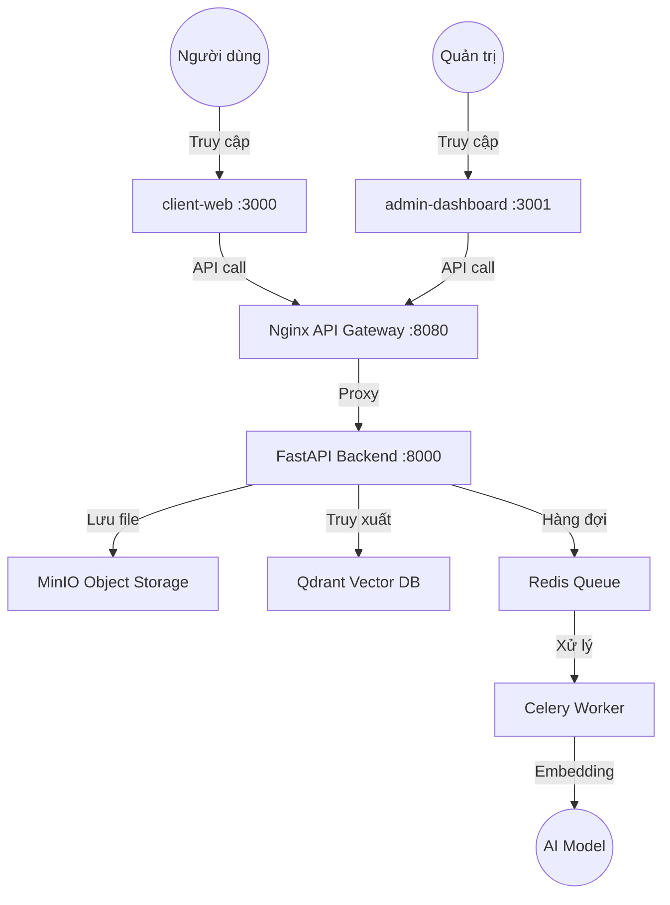

# Technical RepoRAG: Hệ thống hỗ trợ tra cứu Tài liệu Kỹ thuật & Lab

## Tổng quan dự án
Dự án này hướng đến việc xây dựng một hệ thống Retrieval-Augmented Generation (RAG) chuyên sâu cho lĩnh vực kỹ thuật và công nghệ. Hệ thống tập trung vào một tập dữ liệu có độ chính xác cao và giàu tính chuyên môn, chẳng hạn như tài liệu chính thức về Docker, Kubernetes, hoặc các học phần khó trong kiến trúc máy tính và hệ điều hành.

Mục tiêu chính của dự án là hỗ trợ người học và lập trình viên tra cứu, phân tích và giải quyết các vấn đề kỹ thuật phức tạp trong khi thực hiện dự án. Hệ thống có thể được sử dụng để giải thích lỗi cấu hình hệ thống, hướng dẫn xử lý sự cố khi làm việc với container hoặc cluster, cũng như phân tích các đoạn mã Assembly, C, hoặc các ví dụ kỹ thuật khó hiểu.

## Nguồn dữ liệu

Dữ liệu đầu vào của hệ thống bao gồm:

Documentation chính thức từ các công nghệ hoặc môn học được chọn
Các bài Lab thực hành
Mã nguồn mẫu
Code snippets và ví dụ cấu hình
Tài liệu Markdown có cấu trúc

Việc sử dụng nguồn dữ liệu chính thống giúp hệ thống đưa ra câu trả lời có độ tin cậy cao, giảm tình trạng trả lời sai hoặc suy diễn không có căn cứ.
## Thiết lập và cài đặt
Sau khi pull dự án về:
### Bước 1: Thiết lập .env qua khung mẫu được cho sẵn 
```bash
cp .env_example .env
```

### Bước 2: Khởi động dự án bằng Docker
```bash
docker compose up --build
```

### Bước 3: Truy cập các dịch vụ và ứng dụng

Sau khi toàn bộ hệ thống container khởi động thành công và log hiển thị trạng thái kết nối Database báo xanh, bạn có thể truy cập các thành phần của hệ thống Technical RAG thông qua các đường dẫn local dưới đây:

#### 1. Các ứng dụng giao diện (Frontend)
* **Trang dành cho Người dùng cuối (`client-web`)**:
    * **Đường dẫn:** `http://localhost:3000`
    * **Chức năng:** Giao diện tối giản, tập trung phục vụ người dùng thường tra cứu, tải lên tài liệu RAG cá nhân và tham gia các phiên chat hỏi đáp thông minh với AI.
* **Trang dành cho Quản trị viên (`admin-dashboard`)**:
    * **Đường dẫn:** `http://localhost:3001`
    * **Chức năng:** Giao diện tối cao độc quyền dành cho Admin. Hỗ trợ giám sát toàn bộ danh bạ thành viên, theo dõi tiến độ xử lý tác vụ nền (`ingestion pipeline`) và quản lý kho tri thức chung của hệ thống.

#### 2. Hệ thống kiểm soát và Cơ sở dữ liệu (Backend & DB Infrastructure)
* **Cổng API tập trung (`Nginx API Gateway`)**:
    * **Đường dẫn:** `http://localhost:8080`
    * **Chức năng:** API gateway / load balancer cho toàn bộ request từ frontend/admin đến backend. Tất cả API call từ trình duyệt (`localhost:3000` / `localhost:3001`) đều đi qua cổng này. Truy cập Swagger UI tại `http://localhost:8080/docs`.
* **Tài liệu tương tác API (`FastAPI Swagger UI — debug trực tiếp`)**:
    * **Đường dẫn:** `http://localhost:8000/docs`
    * **Chức năng:** Truy cập Swagger trực tiếp vào backend để debug trong giai đoạn phát triển. Chỉ nên dùng khi cần kiểm tra backend không qua Nginx.
* **Trình quản lý tệp tin tập trung (`MinIO Object Storage Console`)**:
    * **Đường dẫn:** `http://localhost:9001`
    * **Chức năng:** Quản lý kho lưu trữ tệp tin thô. Sử dụng tài khoản đăng nhập cấu hình trong file `.env` (`MINIO_ACCESS_KEY` & `MINIO_SECRET_KEY`) để kiểm tra các file tài liệu đã được nạp thành công vào bucket `rag-documents` hay chưa.
* **Bảng điều khiển cơ sở dữ liệu vector (`Qdrant Dashboard`)**:
    * **Đường dẫn:** `http://localhost:6333/dashboard`
    * **Chức năng:** Giám sát không gian lưu trữ các `collections` vector. Giúp kiểm tra số lượng các điểm vector embeddings mà Celery Worker đã băm nhỏ và index thành công từ file tài liệu gốc.

---

### Lưu ý quan trọng cho các thành viên phát triển:
1. Toàn bộ API request từ frontend (`:3000`) và admin (`:3001`) đi qua Nginx gateway tại `http://localhost:8080`. Backend trực tiếp tại `:8000` chỉ dùng để debug phát triển.
2. Nếu cần rebuild frontend/admin sau khi thay đổi biến `NEXT_PUBLIC_API_URL`, chạy `docker compose up --build` để build lại container.
3. Khi thực hiện đăng xuất trên bất kỳ cổng giao diện nào (3000 hoặc 3001), hệ thống sẽ tự động quét sạch cookie và phiên đăng nhập, hãy đảm bảo bạn quay lại đúng trang đăng nhập phù hợp với quyền hạn tài khoản của mình.

## Kiến trúc hệ thống


## Đánh giá hệ thống

## Công nghệ được sử dụng

| Thành phần       | Công nghệ                                     |
| ---------------- | --------------------------------------------- |
| Language         | Python 3.13                                   |
| Framework        | FastAPI (Backend), Next.js (Frontend)         |
| AI Orchestration | LangChain                                     |
| Vector DB        | Qdrant |
| Storage          | MinIO (Object Storage), PostgreSQL (Metadata) |
| Infrastructure   | Docker, Nginx, Redis                          |

## Cấu trúc thư mục
- `apps/api-server`: Backend xử lý logic RAG.

- `apps/client-web`: Giao diện người dùng kiểu Gemini.

- `apps/admin-dashboard`: Giao diện quản trị viên.

- `infra/nginx/`: Cấu hình Nginx API gateway (`nginx.conf`).

- `docs/`: Tài liệu dự án và hướng dẫn mở rộng.

## Tài liệu tham khảo

- [`docs/nginx-local-gateway.md`](docs/nginx-local-gateway.md) — Hướng dẫn mở rộng Nginx gateway cho production (scale, TLS, healthcheck, log format).
- [`docs/handoffs.md`](docs/handoffs.md) — Nhật ký handoff giữa các phase triển khai Nginx.
- [`DESIGN.md`](DESIGN.md) — Thiết kế tổng quan hệ thống.

## Thành viên thực hiện
- `Phạm Quang Tiến`
- `Vũ Ngọc Sơn`
- `Đỗ Duy Thành`
- `Đỗ Khắc Phúc Thịnh`